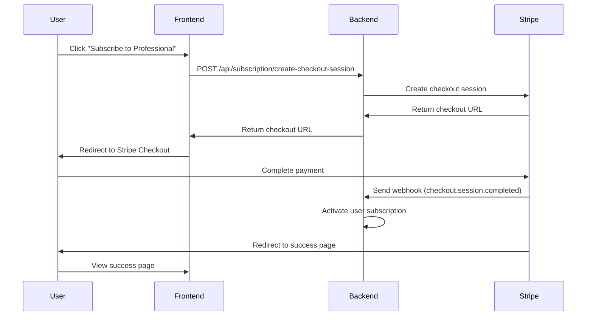

# Backend Integration Guide for Stripe Checkout

This document provides detailed specifications for implementing the backend endpoints required for the Stripe Checkout integration.

## Overview

The frontend has been migrated from custom Stripe Elements to prebuilt Stripe Checkout pages. This requires three main backend endpoints and proper webhook handling for subscription fulfillment.

## Required Dependencies

```bash
npm install stripe
# or
yarn add stripe
```

## Environment Variables

```bash
STRIPE_SECRET_KEY=sk_test_51... # Your Stripe secret key
STRIPE_WEBHOOK_SECRET=whsec_... # Webhook endpoint secret (from Stripe Dashboard)
```

## Required Endpoints

### 1. Create Checkout Session

**Endpoint:** `POST /api/subscription/create-checkout-session`

**Purpose:** Creates a Stripe Checkout session for subscription purchases

**Authentication:** Required (JWT Bearer token)

#### Request Payload
```json
{
  "lookupKey": "professional_monthly",
  "successUrl": "https://yourdomain.com/subscription/success?session_id={CHECKOUT_SESSION_ID}",
  "cancelUrl": "https://yourdomain.com/subscription/cancel"
}
```

#### Implementation Example (Node.js/Express)
```javascript
const stripe = require('stripe')(process.env.STRIPE_SECRET_KEY);

app.post('/api/subscription/create-checkout-session', authenticateToken, async (req, res) => {
  try {
    const { lookupKey, successUrl, cancelUrl } = req.body;
    const userId = req.user.id; // From JWT token

    // Validate required fields
    if (!lookupKey || !successUrl || !cancelUrl) {
      return res.status(400).json({
        status: 'error',
        message: 'Missing required fields: lookupKey, successUrl, cancelUrl'
      });
    }

    // Retrieve the price using the lookup key
    const prices = await stripe.prices.list({
      lookup_keys: [lookupKey],
      expand: ['data.product']
    });

    if (prices.data.length === 0) {
      return res.status(400).json({
        status: 'error',
        message: `No price found for lookup key: ${lookupKey}`
      });
    }

    const price = prices.data[0];

    // Get or create Stripe customer
    let customer = await findOrCreateStripeCustomer(userId, req.user.email);

    // Create Checkout Session
    const session = await stripe.checkout.sessions.create({
      billing_address_collection: 'auto',
      line_items: [
        {
          price: price.id,
          quantity: 1,
        },
      ],
      mode: 'subscription',
      success_url: successUrl,
      cancel_url: cancelUrl,
      customer: customer.id,
      metadata: {
        user_id: userId.toString(),
        lookup_key: lookupKey
      },
      subscription_data: {
        metadata: {
          user_id: userId.toString(),
          lookup_key: lookupKey
        }
      },
      automatic_tax: { enabled: true },
      customer_update: {
        address: 'auto',
        name: 'auto'
      }
    });

    res.json({
      status: 'success',
      data: {
        url: session.url,
        sessionId: session.id
      }
    });

  } catch (error) {
    console.error('Error creating checkout session:', error);
    res.status(500).json({
      status: 'error',
      message: 'Failed to create checkout session',
      error: process.env.NODE_ENV === 'development' ? error.message : undefined
    });
  }
});

// Helper function to find or create Stripe customer
async function findOrCreateStripeCustomer(userId, email) {
  // First, check if user already has a Stripe customer ID in your database
  const user = await getUserById(userId); // Your database query
  
  if (user.stripe_customer_id) {
    try {
      const customer = await stripe.customers.retrieve(user.stripe_customer_id);
      return customer;
    } catch (error) {
      // Customer doesn't exist in Stripe, create new one
    }
  }

  // Create new Stripe customer
  const customer = await stripe.customers.create({
    email: email,
    metadata: {
      user_id: userId.toString()
    }
  });

  // Save Stripe customer ID to your database
  await updateUserStripeCustomerId(userId, customer.id);

  return customer;
}
```

#### Expected Response
```json
{
  "status": "success",
  "data": {
    "url": "https://checkout.stripe.com/c/pay/cs_test_...",
    "sessionId": "cs_test_..."
  }
}
```

#### Error Responses
```json
// Missing fields
{
  "status": "error",
  "message": "Missing required fields: lookupKey, successUrl, cancelUrl"
}

// Invalid lookup key
{
  "status": "error",
  "message": "No price found for lookup key: professional_monthly"
}

// Server error
{
  "status": "error",
  "message": "Failed to create checkout session"
}
```

---

### 2. Create Customer Portal Session

**Endpoint:** `POST /api/subscription/create-portal-session`

**Purpose:** Creates a Stripe Customer Portal session for subscription management

**Authentication:** Required (JWT Bearer token)

#### Request Payload
```json
{
  "returnUrl": "https://yourdomain.com/settings"
}
```

#### Implementation Example
```javascript
app.post('/api/subscription/create-portal-session', authenticateToken, async (req, res) => {
  try {
    const { returnUrl } = req.body;
    const userId = req.user.id;

    // Validate required fields
    if (!returnUrl) {
      return res.status(400).json({
        status: 'error',
        message: 'Missing required field: returnUrl'
      });
    }

    // Get user's Stripe customer ID
    const user = await getUserById(userId);
    
    if (!user.stripe_customer_id) {
      return res.status(400).json({
        status: 'error',
        message: 'No active subscription found'
      });
    }

    // Create portal session
    const portalSession = await stripe.billingPortal.sessions.create({
      customer: user.stripe_customer_id,
      return_url: returnUrl,
    });

    res.json({
      status: 'success',
      data: {
        url: portalSession.url
      }
    });

  } catch (error) {
    console.error('Error creating portal session:', error);
    res.status(500).json({
      status: 'error',
      message: 'Failed to create portal session',
      error: process.env.NODE_ENV === 'development' ? error.message : undefined
    });
  }
});
```

#### Expected Response
```json
{
  "status": "success",
  "data": {
    "url": "https://billing.stripe.com/p/session/..."
  }
}
```

#### Error Responses
```json
// Missing fields
{
  "status": "error",
  "message": "Missing required field: returnUrl"
}

// No subscription
{
  "status": "error",
  "message": "No active subscription found"
}
```

---

### 3. Stripe Webhook Handler

**Endpoint:** `POST /api/webhooks/stripe`

**Purpose:** Handles Stripe webhook events for subscription lifecycle management

**Authentication:** Stripe signature verification (no JWT required)

#### Implementation Example
```javascript
// Use raw body parser for webhook signature verification
app.use('/api/webhooks/stripe', express.raw({ type: 'application/json' }));

app.post('/api/webhooks/stripe', async (req, res) => {
  const sig = req.headers['stripe-signature'];
  let event;

  try {
    // Verify webhook signature
    event = stripe.webhooks.constructEvent(req.body, sig, process.env.STRIPE_WEBHOOK_SECRET);
  } catch (err) {
    console.error('Webhook signature verification failed:', err.message);
    return res.status(400).send(`Webhook Error: ${err.message}`);
  }

  try {
    // Handle the event
    switch (event.type) {
      case 'checkout.session.completed':
        await handleCheckoutSessionCompleted(event.data.object);
        break;

      case 'customer.subscription.created':
        await handleSubscriptionCreated(event.data.object);
        break;

      case 'customer.subscription.updated':
        await handleSubscriptionUpdated(event.data.object);
        break;

      case 'customer.subscription.deleted':
        await handleSubscriptionDeleted(event.data.object);
        break;

      case 'invoice.payment_succeeded':
        await handleInvoicePaymentSucceeded(event.data.object);
        break;

      case 'invoice.payment_failed':
        await handleInvoicePaymentFailed(event.data.object);
        break;

      default:
        console.log(`Unhandled event type: ${event.type}`);
    }

    res.status(200).json({ received: true });
  } catch (error) {
    console.error('Error processing webhook:', error);
    res.status(500).json({ error: 'Webhook processing failed' });
  }
});

// Webhook event handlers
async function handleCheckoutSessionCompleted(session) {
  console.log('Checkout session completed:', session.id);
  
  // Extract user ID from metadata
  const userId = session.metadata.user_id;
  const lookupKey = session.metadata.lookup_key;
  
  if (!userId) {
    console.error('No user_id in session metadata');
    return;
  }

  // Retrieve the subscription
  if (session.subscription) {
    const subscription = await stripe.subscriptions.retrieve(session.subscription);
    
    // Update user's subscription in your database
    await updateUserSubscription(userId, {
      stripe_subscription_id: subscription.id,
      stripe_customer_id: subscription.customer,
      plan_lookup_key: lookupKey,
      status: subscription.status,
      current_period_start: new Date(subscription.current_period_start * 1000),
      current_period_end: new Date(subscription.current_period_end * 1000),
      created_at: new Date()
    });

    console.log(`Subscription ${subscription.id} activated for user ${userId}`);
  }
}

async function handleSubscriptionCreated(subscription) {
  console.log('Subscription created:', subscription.id);
  
  const userId = subscription.metadata.user_id;
  const lookupKey = subscription.metadata.lookup_key;
  
  if (userId) {
    await updateUserSubscription(userId, {
      stripe_subscription_id: subscription.id,
      stripe_customer_id: subscription.customer,
      plan_lookup_key: lookupKey,
      status: subscription.status,
      current_period_start: new Date(subscription.current_period_start * 1000),
      current_period_end: new Date(subscription.current_period_end * 1000)
    });
  }
}

async function handleSubscriptionUpdated(subscription) {
  console.log('Subscription updated:', subscription.id);
  
  const userId = subscription.metadata.user_id;
  
  if (userId) {
    await updateUserSubscription(userId, {
      status: subscription.status,
      current_period_start: new Date(subscription.current_period_start * 1000),
      current_period_end: new Date(subscription.current_period_end * 1000),
      updated_at: new Date()
    });
  }
}

async function handleSubscriptionDeleted(subscription) {
  console.log('Subscription deleted:', subscription.id);
  
  const userId = subscription.metadata.user_id;
  
  if (userId) {
    await updateUserSubscription(userId, {
      status: 'canceled',
      canceled_at: new Date()
    });
  }
}

async function handleInvoicePaymentSucceeded(invoice) {
  console.log('Invoice payment succeeded:', invoice.id);
  
  if (invoice.subscription) {
    const subscription = await stripe.subscriptions.retrieve(invoice.subscription);
    const userId = subscription.metadata.user_id;
    
    if (userId) {
      // Update subscription period and ensure it's active
      await updateUserSubscription(userId, {
        status: 'active',
        current_period_start: new Date(subscription.current_period_start * 1000),
        current_period_end: new Date(subscription.current_period_end * 1000),
        last_payment_date: new Date()
      });
    }
  }
}

async function handleInvoicePaymentFailed(invoice) {
  console.log('Invoice payment failed:', invoice.id);
  
  if (invoice.subscription) {
    const subscription = await stripe.subscriptions.retrieve(invoice.subscription);
    const userId = subscription.metadata.user_id;
    
    if (userId) {
      // Mark subscription as past due
      await updateUserSubscription(userId, {
        status: 'past_due',
        payment_failed_at: new Date()
      });
    }
  }
}
```

#### Required Webhook Events

Configure these events in your Stripe Dashboard webhook settings:

- `checkout.session.completed`
- `customer.subscription.created`
- `customer.subscription.updated`
- `customer.subscription.deleted`
- `invoice.payment_succeeded`
- `invoice.payment_failed`

---

## Database Schema

### Recommended User Subscription Table

```sql
CREATE TABLE user_subscriptions (
  id SERIAL PRIMARY KEY,
  user_id INTEGER NOT NULL REFERENCES users(id),
  stripe_subscription_id VARCHAR(255) UNIQUE,
  stripe_customer_id VARCHAR(255),
  plan_lookup_key VARCHAR(100),
  status VARCHAR(50) NOT NULL DEFAULT 'inactive',
  current_period_start TIMESTAMP,
  current_period_end TIMESTAMP,
  canceled_at TIMESTAMP,
  created_at TIMESTAMP DEFAULT CURRENT_TIMESTAMP,
  updated_at TIMESTAMP DEFAULT CURRENT_TIMESTAMP,
  last_payment_date TIMESTAMP,
  payment_failed_at TIMESTAMP
);

-- Add index for faster lookups
CREATE INDEX idx_user_subscriptions_user_id ON user_subscriptions(user_id);
CREATE INDEX idx_user_subscriptions_stripe_subscription_id ON user_subscriptions(stripe_subscription_id);
CREATE INDEX idx_user_subscriptions_status ON user_subscriptions(status);
```

### Add Stripe Customer ID to Users Table

```sql
ALTER TABLE users ADD COLUMN stripe_customer_id VARCHAR(255);
CREATE INDEX idx_users_stripe_customer_id ON users(stripe_customer_id);
```

---

## Stripe Dashboard Configuration

### 1. Create Products and Prices

Create these products in your Stripe Dashboard with the corresponding lookup keys:

| Product Name | Price | Lookup Key | Billing |
|--------------|-------|------------|---------|
| 基礎方案 (Basic) | $9.99 | `basic_monthly` | Monthly |
| 專業方案 (Professional) | $29.99 | `professional_monthly` | Monthly |
| 企業方案 (Enterprise) | $99.99 | `enterprise_monthly` | Monthly |

### 2. Customer Portal Configuration

Enable the Customer Portal in your Stripe Dashboard and configure:

- **Business information**: Company name, website, support email
- **Features**: Allow customers to update payment methods, billing address, and cancel subscriptions
- **Branding**: Upload your logo and customize colors

### 3. Webhook Endpoint

1. Go to Stripe Dashboard → Webhooks
2. Add endpoint: `https://yourdomain.com/api/webhooks/stripe`
3. Select the events listed above
4. Copy the webhook secret to your environment variables

---

## Security Considerations

1. **Webhook Signature Verification**: Always verify webhook signatures to ensure requests come from Stripe
2. **Idempotency**: Handle duplicate webhook events gracefully (use Stripe event IDs to track processed events)
3. **Error Handling**: Implement proper error logging and monitoring
4. **Rate Limiting**: Implement rate limiting on API endpoints
5. **Input Validation**: Validate all input parameters
6. **HTTPS Only**: All endpoints must use HTTPS in production

---

## Testing

### Test Cards

Use these test card numbers during development:

- **Successful payment**: `4242424242424242`
- **Payment declined**: `4000000000000002`
- **Requires authentication**: `4000002500003155`

### Test Webhooks

Use Stripe CLI to test webhooks locally:

```bash
stripe listen --forward-to localhost:3000/api/webhooks/stripe
stripe trigger checkout.session.completed
```

---

## Error Handling and Monitoring

### Recommended Logging

```javascript
// Log all webhook events
console.log(`Received webhook: ${event.type} - ${event.id}`);

// Log subscription changes
console.log(`User ${userId} subscription ${subscription.id} status: ${subscription.status}`);

// Log errors with context
console.error('Webhook processing failed:', {
  eventId: event.id,
  eventType: event.type,
  error: error.message,
  userId: userId
});
```

### Health Check Endpoint

```javascript
app.get('/api/health/stripe', async (req, res) => {
  try {
    // Test Stripe connection
    await stripe.accounts.retrieve();
    res.json({ status: 'healthy', stripe: 'connected' });
  } catch (error) {
    res.status(500).json({ status: 'unhealthy', stripe: 'disconnected', error: error.message });
  }
});
```

---

### 4. Get Payment Methods

**Endpoint:** `GET /api/subscription/payment-methods`

**Purpose:** Retrieves the customer's saved payment methods from Stripe

**Authentication:** Required (JWT Bearer token)

#### Implementation Example
```javascript
app.get('/api/subscription/payment-methods', authenticateToken, async (req, res) => {
  try {
    const userId = req.user.id;

    // Get user's Stripe customer ID
    const user = await getUserById(userId);
    
    if (!user.stripe_customer_id) {
      return res.status(404).json({
        status: 'error',
        message: 'No customer found'
      });
    }

    // Retrieve payment methods from Stripe
    const paymentMethods = await stripe.paymentMethods.list({
      customer: user.stripe_customer_id,
      type: 'card',
    });

    // Format the response
    const formattedMethods = paymentMethods.data.map(pm => ({
      id: pm.id,
      brand: pm.card.brand,
      last4: pm.card.last4,
      exp_month: pm.card.exp_month,
      exp_year: pm.card.exp_year,
      is_default: pm.id === user.default_payment_method_id // If you track default payment method
    }));

    res.json({
      status: 'success',
      data: {
        payment_methods: formattedMethods
      }
    });

  } catch (error) {
    console.error('Error retrieving payment methods:', error);
    res.status(500).json({
      status: 'error',
      message: 'Failed to retrieve payment methods',
      error: process.env.NODE_ENV === 'development' ? error.message : undefined
    });
  }
});
```

#### Expected Response
```json
{
  "status": "success",
  "data": {
    "payment_methods": [
      {
        "id": "pm_1234567890",
        "brand": "visa",
        "last4": "4242",
        "exp_month": 12,
        "exp_year": 2025,
        "is_default": true
      },
      {
        "id": "pm_0987654321",
        "brand": "mastercard",
        "last4": "5555",
        "exp_month": 6,
        "exp_year": 2026,
        "is_default": false
      }
    ]
  }
}
```

#### Error Responses
```json
// No customer found
{
  "status": "error",
  "message": "No customer found"
}

// Server error
{
  "status": "error",
  "message": "Failed to retrieve payment methods"
}
```

---

## Frontend-Backend Data Flow



This integration provides a secure, PCI-compliant subscription system with minimal frontend complexity and robust backend handling of subscription lifecycle events.